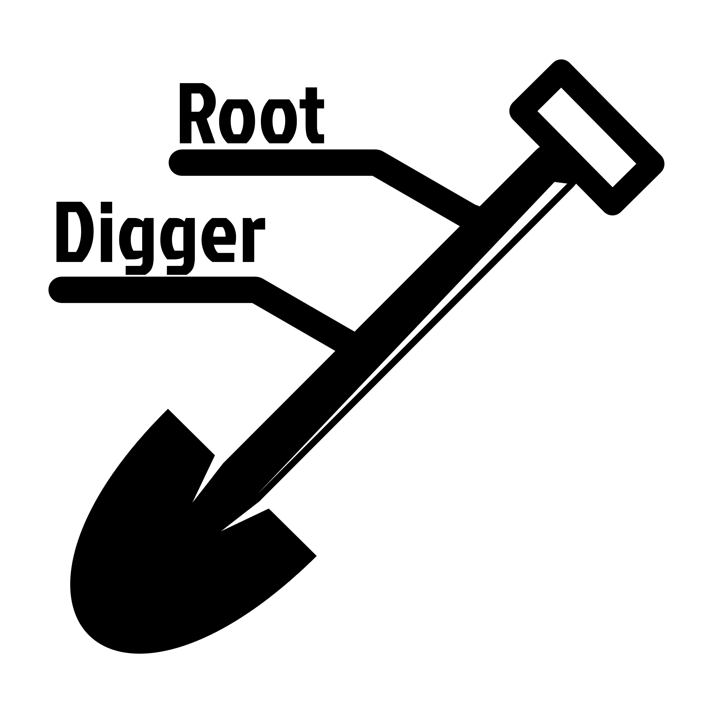

# RootDigger



RootDigger is a program that will, when given a MSA and an unrooted tree with
branch lengths place a root on the given tree. For the foreseeable future,
RootDigger will only support DNA data, as the method RootDigger uses is
ineffective when using AA data.

# Building

Currently, the best way to get the most recent version of RootDigger is by
cloning the repository

    git clone --recursive https://github.com/computations/root_digger

This will obtain all the required dependencies including (except for BLAS and LAPACKE, which are discussed below)
`coraxlib`, as of `v1.8.0`. Previously, coraxlib required a modified version of `libpll` and the library GSL.

Root digger requires `cmake` to build. There is a `makefile` provided which will
set up the build directory and build the software automatically. Once the
software is built, the binary `rd` is placed in the `bin` directory, along with
`rd_test`, which is the test suite.

## BLAS and LAPACKE

RootDigger relies on `coraxlib` to compute the phylogenetic likelihood. `coraxlib` in turn relies on BLAS and LAPACKE to
compute some fundamental linear algebra operations. This means that both BLAS and LAPACKE are requirements of
RootDigger. Fortunately, BLAS and LAPACKE can be supplied by many sources. I recommend OpenBLAS for both, but Intel's MKL
will also work. For both of these, I strongly recommend installing the libraries through your pacakage manager (e.g.
`apt`, `apt-get`, `brew`, `yum`, or `pacman`) instead of installing them manually. If there is _any_ difficulty at all
installing these libraries, the Docker image (discussed below) should be used instead).

## Parallelism

As of version 1.4, root digger supports a rudimentary version of both thread and
process level parallelism. Both are optional. By default, if cmake can find
OpenMP, it will build with it. 

For MPI, a special build flag needs to be passed. There is a `mpi` target for
the makefile, so  in most cases running `make mpi` should be sufficient. In
cases where this doesn't work, the base command is

    cmake -DMPI_BUILD=ON -DCMAKE_BUILD_TYPE=Release

In general, MPI is better to use on larger trees.

# Usage

    ./rd --msa <MSA FILE> --tree <TREE FILE>

The MSA file can be in any format that is supported by `libpll`, which at the
time of writing is one of: "relaxed" phylip or fasta. The tree file should
contain a metric tree (this is to say, branch lengths which are in expected
substitutions per site) in newick format.

By default, RootDigger runs in search mode with early stopping on. This means
that RootDigger will simply look for the most likely root, and will "stop
early". This means that RootDigger will consider the search concluded when it
finds the same root placement twice in a row (as opposed to requiring that the
likelihood is the same twice in a row).

RootDigger can be run in exhaustive mode using `--exhaustive`. This will cause
RootDigger to consider every branch, and report the Likelihood Weight Ratio of
placing the root on that branch. Informally, this can be interpreted as the
probability of placing the root on a given branch. By default, `--exhaustive`
mode does _not_ run with early stopping. This can be enabled using
`--early-stop`. In practice, this doesn't affect the results at all, but in
principle it could, so be warned.

For more information about the options, there is a `--help` flag which will
print detailed information about all the options.

## Options

```
Application Options:
--msa [FILE]
     File containing the alignment.
--tree [FILE]
     File containing the tree, with branch lengths.
--partition [FILE]
     Optional file containing the partition specification.
     Format is the same as RAxML-NG partition file.
--prefix [STRING]
     Prefix for the output files.
--exhaustive
     Enable exhaustive mode. This will attempt to root a tree
     at every branch, and then report the results using LWR.
--early-stop
     Enable early stopping. This will cause cause the search
     to terminate when the root placement is sufficently
     close for 2 consecutive iterations. How close they need
     to be can be controled by brtol. Is enabled by default for
     search mode and disabled by default for exhaustive mode.
--no-early-stop
     Force disable early stop.
--seed [NUMBER]
     Random seed to use. Optional
--rate-cats [NUMBER]
     Number of rate categories to use for the model. Default
     is 1.
--invariant-sites
     Enable invariant sites. Default is off.
--min-roots [NUMBER]
     Minimum number of roots to start from. Optional,
     Default is 1.
--root-ratio [NUMBER]
     Proportion of potential starting roots to attempt
     Default is 0.01
--atol [NUMBER]
     Root optmization stopping tolerance. Increase this to 
     improve results.Default is 1e-4
--brtol [NUMBER]
     When early stop mode is enabled, this controls the
     distance required to trigger. Default is 1e-12
--bfgstol [NUMBER]
     Tolerance for the BFGS steps. Default is 1e-7
--factor [NUMBER]
     Factor for the BFGS steps. Default is 1e2
--initial-root-strategy {random, midpoint, modified-mad}
     The strategy to pick the initial branches for rooting.
     Random is the default, and simply picks the branches at
     random. Midpoint uses the midpoint and similar branches to
     start. Modified MAD will use a modified version of mad to
     pick the starting branches. This can actually drive the
     so care should be taken when selecting this option.
     Default is random
--threads [NUMBER]
     Number of threads to use
--silent
     Suppress output except for the final tree
--verbose
     Increase the verbosity level. Can be repeated to
     level further.
--clean
     Clean the checkpoint file and exit. Normally, this should
     not be needed, but occasionally cleaining on a multi-node
     system can take a lot of time. In that case, use this flag
     on a single node, which will make RootDigger clean the
     checkpoint file so that the job can be run quickly on
     multi-node systems.
```

# Docker file

There is a Docker file in the case that building the software natively is too difficult. In this case, the software can
be built with 

```
docker build -t my_rd .
```

and run with

```
docker run my_rd:latest
```

In order to get files into the container, volumes should be used. An example where the files are in a local directory is

```
docker run -v $(pwd):/data/ my_rd:latest --msa /data/<MSA FILE> --tree /data/<TREE FILE>
```

# TL;DR

**Dependencies**: 

- Cmake 3.0
- C++14 compatible compiler

**Optional Dependencies**:

- OpenMP for thread level parallelism
- Some MPI package for process level parallelism

**Usage**:

For search mode:

    rd --msa <MSA> --tree <TREE> 

For exhaustive mode:

    rd --msa <MSA> --tree <TREE> --exhaustive
